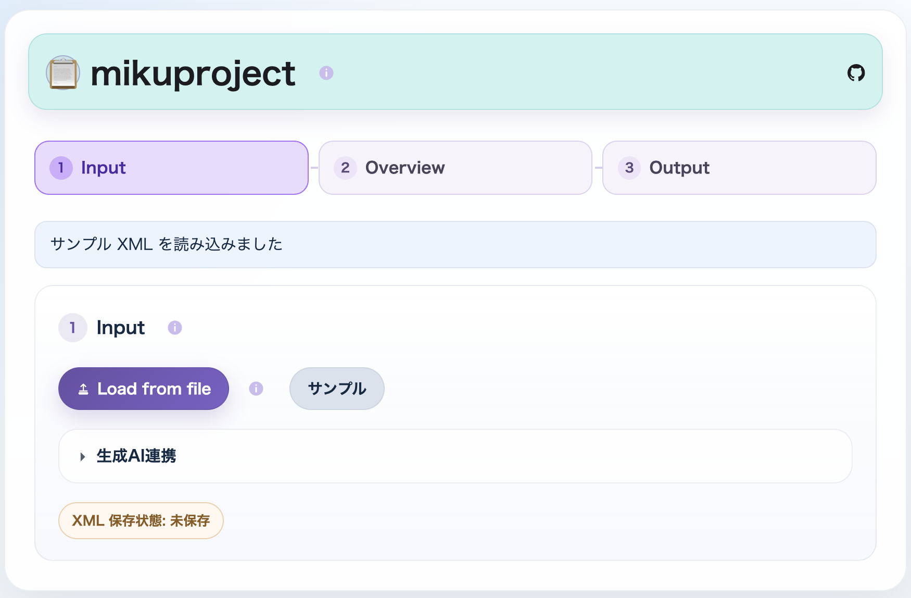
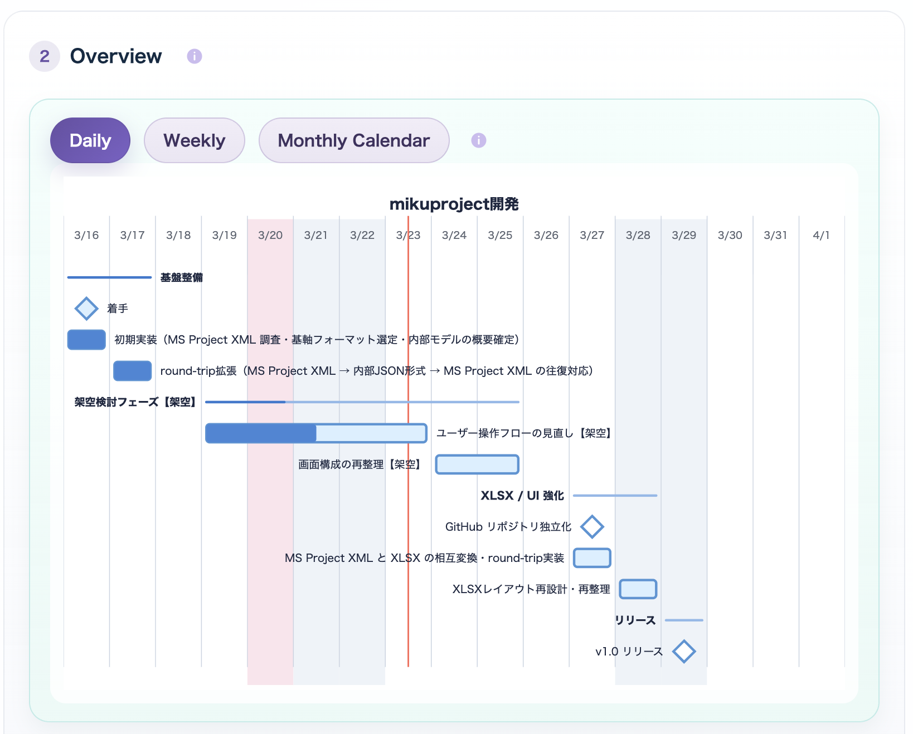
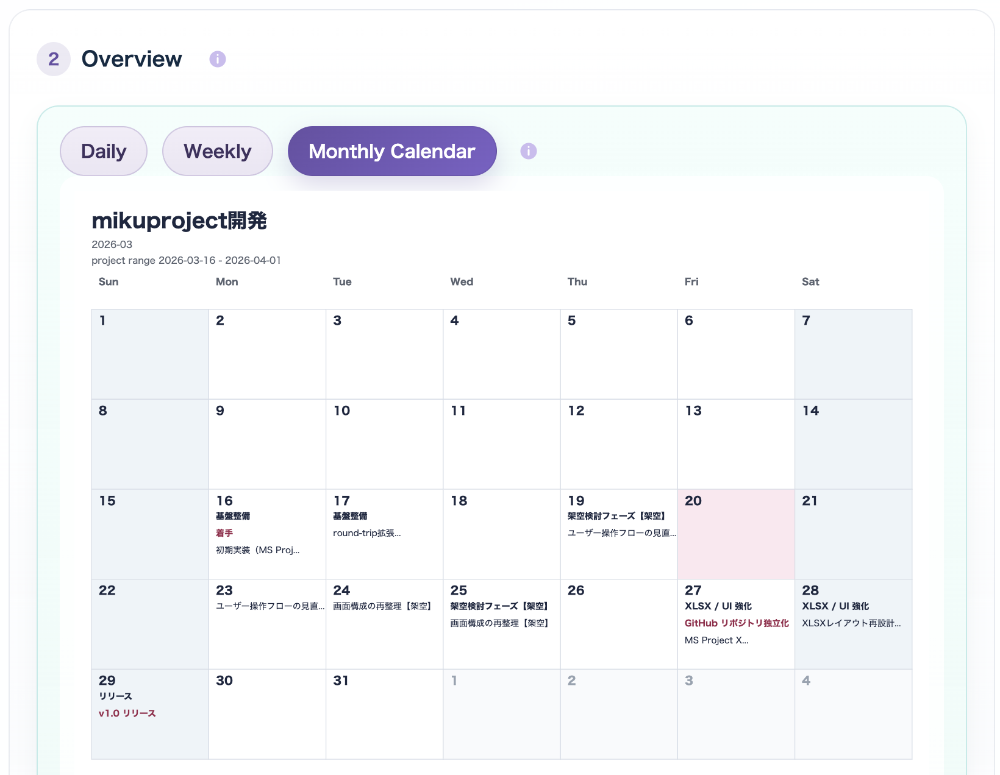
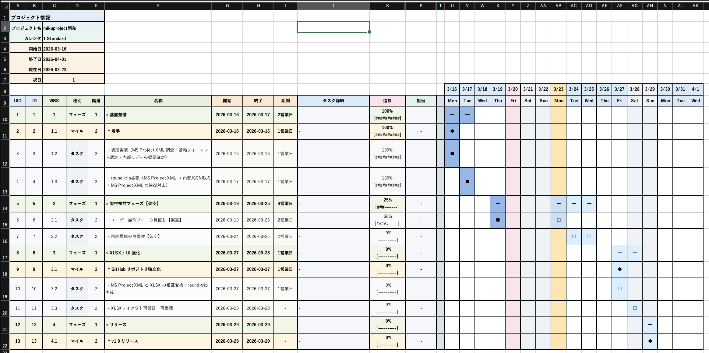
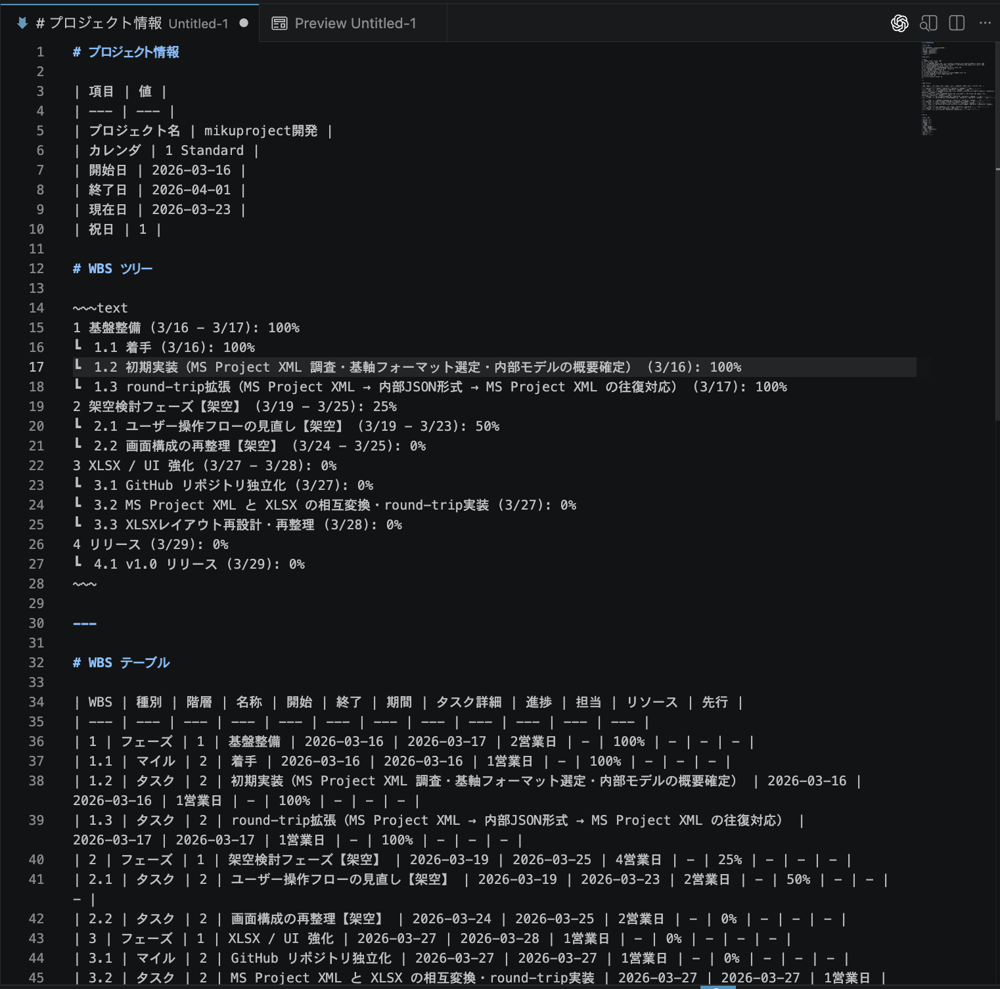

# mikuproject


GitHub: https://github.com/igapyon/mikuproject

`mikuproject` は、`MS Project XML` を意味の基軸に、生成AIとの往復を支えるために設計されたローカル HTML ツールです。WBS の草案作成から再編集・再取込、人向けの可視化・帳票化までを、ひとつの流れとして扱えます。

`mikuproject` の強みは、`MS Project XML` を意味の基軸として保ちながら、生成AIと人のあいだを往復できることです。WBS 草案の作成、生成AI が扱いやすい形への表現変換、生成AI から返った内容の再取込、人による確認と修正、そして可視化・帳票化までを、同じプロジェクト情報の流れとして扱えます。`XLSX`、`Markdown`、`JSON`、`Mermaid`、生成AI向け表現、そして必要に応じた `MS Project` への橋渡しは、それぞれの用途に応じた周辺表現として無理なく出し分けられます。

特に、次の 3 つを重視して設計しています。

- `MS Project XML` を意味の基軸として保つこと
- 生成AIと人の往復に適した表現変換 / 再取込 / 介在を支えること
- 人が読むための可視化と、WBS 帳票・SVG を含む成果物出力を提供すること

配布物は `mikuproject.html` ひとつの single-file web app で、Web ブラウザさえあればインストール不要・ネットワーク不要で利用できます。

`MS Project XML` を意味の基軸として扱い、`.xlsx` と workbook JSON は確認・可視化・限定編集のための周辺表現として扱います。生成AI 連携の編集用 JSON は、workbook JSON と区別するため当面 `.editjson` 拡張子を推奨します。

## 代表的なユースケース

- その1: 生成AI との対話で WBS 草案を作成し、`mikuproject` に取り込んで、人と生成AIが確認・修正しながら、帳票や可視化成果物として仕上げる
- その2: 既存の `MS Project XML` を `mikuproject` に取り込み、内容を確認しながら、`WBS Excel ブック (.xlsx)` や日次・週次のガント表現や月次カレンダーの `SVG`、`Markdown` などの人向け成果物へ展開する
- その3: `mikuproject` で扱う WBS やプロジェクト情報を生成AI向けに表現変換し、生成AIが返した結果を再び取り込みながら、人と生成AIがレビュー・調整・再利用しやすい形へ整える

## スクリーンショット

### Input

`Load from file`、`サンプル`、`生成AI連携` から入力を受け付ける。



### Overview

`Daily / Weekly / Monthly Calendar` preview をここで行う。



### Overview Monthly Calendar

`Overview` では `Monthly Calendar` preview も確認できる。



### Output

`MS Project XML`、`XLSX`、workbook JSON、`CSV`、`WBS XLSX`、`WBS Markdown`、`Daily / Weekly / Monthly Calendar SVG`、Mermaid、生成AI向け `.editjson`、`ALL` ZIP をここから保存する。


### WBS Excel ブック (.xlsx)

人が読むための帳票として出力される `WBS Excel ブック (.xlsx)` の例。



### WBS Markdown

`WBS ツリー` と `WBS テーブル` を含む `Markdown` 出力の例。



## できること

- 生成AIに渡すためのプロジェクト概要・工程詳細・一式データの出力（`project_overview_view` / `phase_detail_view` / `full bundle`）
- 生成AIが返した WBS 素案の取込（`project_draft_view`）
- 生成AI向けの task 単位編集ビューの出力（`task_edit_view`）
- 生成AIが返した Patch JSON の取込と反映
- `MS Project XML` の読込
- `ProjectModel` への変換と内容確認
- 日次・週次のガント表現、および月次カレンダー可視化の `SVG` 出力
- `Project / Tasks / Resources / Assignments / Calendars` workbook の構造を保ったまま、`XLSX / JSON` で `Export / Import`
- `CSV + ParentID` のファイル読込とダウンロード
- `MS Project XML` の再生成
- 表示専用の `WBS XLSX Export`
- Mermaid gantt テキスト生成

## 使い始め方

もっとも簡単なのは、生成済みの [mikuproject.html](mikuproject.html) をブラウザで開く方法です。

画面上では主に次を行えます。

- `Load from file` からの `MS Project XML / XLSX / workbook JSON (.json) / 生成AI向け編集用 JSON (.editjson) / CSV + ParentID` の読込
- 生成AIによる WBS 草案（`project_draft_view`）をもとに生成した `MS Project XML` の読込
- 生成AIが返した WBS 草案（`project_draft_view`）の JSON 貼り付け取込
- 内部モデル、validation、`Daily / Weekly / Monthly Calendar` preview の確認
- `MS Project XML / XLSX / WBS XLSX / workbook JSON / CSV + ParentID / Daily SVG / Weekly SVG / Monthly Calendar SVG / Mermaid / 生成AI向け編集用 JSON (.editjson)` の保存
- 主要成果物をまとめた `ALL` ZIP の保存

主な保存名の例:

- `Daily SVG`: `mikuproject-wbs-daily-<YYYYMMDDHHmm>.svg`
- `Weekly SVG`: `mikuproject-wbs-weekly-<YYYYMMDDHHmm>.svg`
- `Monthly Calendar SVG`: `mikuproject-monthly-wbs-calendar-<YYYYMMDDHHmm>.zip`
- `ALL`: `mikuproject-all-<YYYYMMDDHHmm>.zip`

`Monthly Calendar SVG` の ZIP 内では、月別ファイルを `monthly-calendar/YYYY-MM.svg` の形で格納します。

### Windows 11 での `SVG` / `ZIP` 取扱いメモ

- `Monthly Calendar SVG` は、月ごとの `SVG` をまとめた `ZIP` として保存される
- `ALL` も、複数の成果物をまとめた `ZIP` として保存される
- `Windows 11` では、ダウンロードした `ZIP` や `SVG` が「危険なファイル」として警告される場合がある
- これは `mikuproject` 固有の独自拡張ではなく、`ZIP` や `SVG` を Windows 側が外部由来ファイルとして慎重に扱う場合があるため
- 少なくとも `Monthly Calendar SVG` と `ALL` の `ZIP` は、アプリ内で生成した成果物をまとめたもの
- 警告の有無や表示文言は、利用するブラウザや Windows の設定に依存する可能性がある

## 開発

```bash
npm install
npm run build
npm test
```

開発用コマンドの詳細、テスト運用、`local-data/` の扱いは [docs/development.md](docs/development.md) を参照してください。

## 関連ドキュメント

- [docs/architecture.md](docs/architecture.md)
- [docs/development.md](docs/development.md)
- [docs/spec.md](docs/spec.md)
- [docs/gap-notes.md](docs/gap-notes.md)
- [docs/mikuproject-ai-json-spec.md](docs/mikuproject-ai-json-spec.md)
- [docs/msprojectxml-ai-integration.md](docs/msprojectxml-ai-integration.md)
- [THIRD-PARTY-NOTICES.md](THIRD-PARTY-NOTICES.md)
- [docs/TODO.md](docs/TODO.md)
- [CONTRIBUTING.md](CONTRIBUTING.md)
- [CONTRIBUTORS.md](CONTRIBUTORS.md)
- [CODE_OF_CONDUCT.md](CODE_OF_CONDUCT.md)
- [LICENSE](LICENSE)
